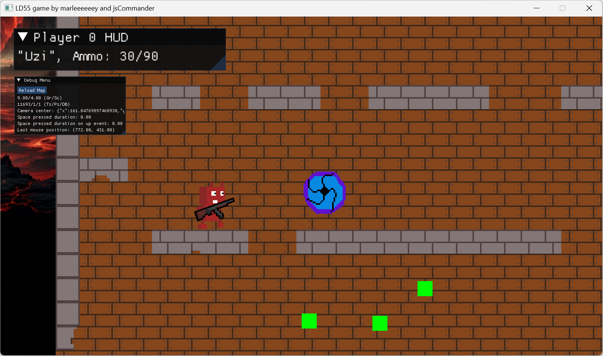

### HUNGRY PORTALS

**Welcome to the HUNGRY PORTALS Game**, a creation by marleeeeeey, jsCommander, and SdCorpse for Ludum Dare 55. Dive into our action-packed, fully destructible world on GitHub: [HUNGRY PORTALS on GitHub](https://github.com/marleeeeeey/LD55-game)

---

### Gameplay Overview

**Hungry portals** from the dark realm are out for blood, and they've turned their attention to your home, trapping your demonic family within their shadowy depths. You start as a lone survivor with a chance to save your kin and reclaim your home.

#### Objective:

- **Total Destruction:** The world is fully destructible. Tear down everything to create fodder for the portals.
- **Rescue and Reunite:** Each portal, when overfed, will burst, releasing a captured family member who will join you in defense.
- **Victory Conditions:** Save all family members and destroy all portals.
- **Defeat Conditions:** The game ends if you lose the last member of your family.

#### Controls:

- **Move:** WASD
- **Jump:** Spacebar, be cautious of falling off edges.
- **Shoot:** Mouse Left Button
- **Build Platforms:** Mouse Right Button; useful for covering holes.
- **Switch to Bazooka:** Key 1
- **Switch to Grenade:** Key 2
- **Scale:** Mouse Wheel
- **Toggle Fullscreen:** F11
- **Drag the screen:** Hold Mouse Middle Button
- **Quit game:** ESC

### Game Mechanics:

- **Portal Dynamics:** Portals that collide with each other disperse chaotically. Stay alert!
- **Building on the Fly:** Construct small platforms to navigate and trap portals.
- **Feeding the Portals:** Without sufficient debris to consume, portals will hunt you down.

### Strategy Tips:

- **Adapt Your Arsenal:** Use the right tools for the right obstacles. Switch between weapons to maximize destruction.
- **Resource Management:** Building materials are infinite. Use them to create platforms and move around the map.
- **Stay Mobile:** Keep moving to avoid being overwhelmed by the portals' influence.
- **Master Your Movements:** Jump frequently; demons move swiftly in the air, allowing for quick navigation and escape. However, exercise caution to avoid accidentally leaping out of the level bounds.

These strategies will help you manage the challenges of the game effectively, making use of your abilities and resources to outmaneuver the dark forces and protect your territory.

### Enjoyment Guaranteed:

Immerse yourself in a chaotic world of destruction and strategy. Make tactical decisions, save your family, and clear your home from the malevolent clutches of the dark realms.

---

### Get Started:

Ready to take on the challenge? Click "Start Game" to begin your journey through a world where every structure can be destroyed and every action counts. Complete all missions and lead your family to victory against the dark portals.
