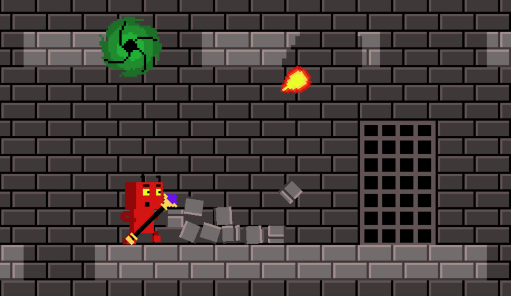

### LD55 Hungry Portals

**Welcome to the LD55 Hungry Portals Game**, a creation by [marleeeeeey](https://www.linkedin.com/in/marleeeeeey), jsCommander, and SdCorpse for Ludum Dare 55. Dive into our action-packed, fully destructible world on GitHub: [LD55 Hungry Portals on GitHub](https://github.com/marleeeeeey/LD55_Hungry_Portals)

---

### Gameplay Overview

**Hungry Portals** from the dark realm are out for blood, and they've turned their attention to your home, trapping your demonic family within their shadowy depths. You start as a lone survivor with a chance to save your kin and reclaim your home.

### Strategy Tips:

- **Ascend to Safety:** Climb as high as you can to escape the gluttonous portals that feed on anything at ground level.
- **Strategic Construction:** Use building blocks to seal floor gaps, preventing potential portal feed from falling through.
- **Heed the Warnings:** Pay attention to the sounds; a siren-like wail indicates a portal is on your trail.

#### Objective:

- **Total Destruction:** The world is fully destructible. Tear down everything to create fodder for the portals.
- **Rescue and Reunite:** Each portal, when overfed, will burst, releasing a captured family member who will join you in defense.
- **Victory Conditions:** Save all family members and destroy all portals.
- **Defeat Conditions:** The game ends if you lose the last member of your family.

#### Controls:

- **Move:** WASD
- **Jump:** Spacebar, be cautious of falling off edges.
- **Shoot:** Mouse Left Button
- **Build Platforms:** Mouse Right Button; useful for covering holes.
- **Switch to Bazooka:** Key 1
- **Switch to Grenade:** Key 2
- **Scale:** Mouse Wheel
- **Toggle Fullscreen:** F11
- **Drag the screen:** Hold Mouse Middle Button
- **Quit game:** ESC

### Enjoyment Guaranteed:

Immerse yourself in a chaotic world of destruction and strategy. Make tactical decisions, save your family, and clear your home from the malevolent clutches of the dark realms.

---

### Get Started:

Ready to take on the challenge? Click "Start Game" to begin your journey through a world where every structure can be destroyed and every action counts. Complete all missions and lead your family to victory against the dark portals.
