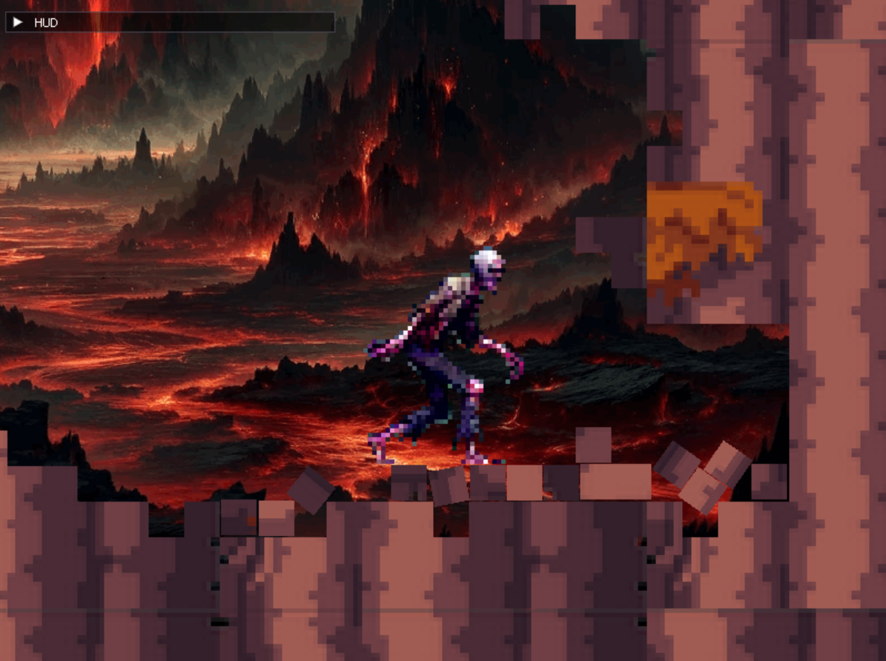

# WOFARES (C++ Game Project)

WOFARES - World OF squARES is a platformer game innovatively designed around the concept of level destruction. It features a unique mechanism where tiles shatter into pieces, with fragments dispersing realistically thanks to the integration of the Box2D physics engine. This game is envisioned to support a two-player mode with a SeatHot gaming style, facilitating intense battles within expansive arena levels.

At the core of WOFARES's engine lies a robust foundation constructed using C++ and leveraging libraries such as SDL, EnTT, gml, imgui, and Box2D. A pivotal aspect of the game's design is the extensive application of the Entity Component System (ECS) pattern. This architectural approach significantly reduces component coupling and simplifies engine maintenance, ensuring a seamless and immersive gaming experience.



## Prerequisites for Building the Project

To successfully build and run WOFARES, the following tools and environments are required:

- **CMake:** Utilized as the build system, CMake is essential for generating build configurations. Ensure you have CMake version 3.15 or higher installed on your system. For download and installation instructions, please visit the [official CMake website](https://cmake.org/download/).

- **C++ Compiler:** The project is built using the Clang compiler, which supports modern C++ standards including C++17. I recommend using Clang for its excellent support for modern C++ features and standards compliance.

- **Visual Studio Code (VSCode):** VSCode is recommended for its robust C++ development environment, facilitated by extensions for CMake and C++ support. Ensure you have VSCode installed, along with the necessary extensions for CMake and C++ development.

- **Git Submodules for Dependencies:** All project dependencies are managed as Git submodules. This approach ensures that there are no external dependencies tied to package managers, streamlining the setup process.

### Platform Support

- This game has been developed, built, and tested solely on **Windows**. While cross-platform libraries suggest the potential for broader compatibility, official support for platforms other than Windows is not currently offered.

### Recommended Tools and Extensions for VSCode

- **Clang Compiler:** For consistent builds across different environments, we recommend using the Clang compiler. It offers comprehensive support for modern C++ standards and is known for its detailed diagnostic messages.

- **Clangd Extension:** To enhance your development experience in VSCode, installing the Clangd extension is highly recommended. It provides features like smart completions, diagnostics, and go-to-definition based on an understanding of your C++ code.

- **Compile Commands for Clangd:** The project is configured to generate a `compile_commands.json` file, which Clangd uses to understand the project's build settings. This ensures that Clangd can provide accurate code analysis and suggestions.

### Setting Up Your Development Environment in VSCode

1. **Install CMake, Ninja and Clang:** Ensure that the latest versions of CMake and Clang are installed on your system.

2. **Visual Studio Code Setup:** After installing VSCode, install the following extensions from the marketplace:
   - CMake Tools
   - Clangd

3. **Clone the Repository and Submodules:**
   - Clone the project repository using the following command, ensuring that all submodules are also cloned:

```
git clone --recursive https://github.com/marleeeeeey/wofares-game.git
```

   - If the repository was cloned without submodules, you can initialize and update them with:

```
git submodule update --init --recursive
```

4. **Build and Run the Project:**
   - Open the project folder in VSCode.
   - Configure the project by selecting a Clang compiler kit in CMake Tools.
   - Press `F5` to build and run the game. This action triggers the CMake configuration, project build, and game launch.
   - Or you can build it via console commands like this:

```
mkdir build
cd build
cmake -G "Ninja" DCMAKE_CXX_COMPILER=clang++ -B . -S ..
cmake --build .
```

### Running the Game

After the successful build, the game executable will be located in the `build` directory. Pressing `F5` in VSCode not only compiles the project but also runs the game, facilitating an immediate start to your gaming experience.

## File Structure

```
wofares/
├── CMakeLists.txt
├── thirdparty/
│   ├── SDL/
│   ├── glm/
│   ├── entt/
│   └── ...
├── src/
│   ├── CMakeLists.txt
│   ├── main.cpp
│   ├── ecs/
│   │   ├── systems/
│   │   └── conponents/
│   └── utils/
├── tests/
│   ├── CMakeLists.txt
│   └── *.cpp
├── assets
│   ├── images
│   │   └── *.png
│   ├── maps
│   │   └── *.json
│   ├── sounds
│   │   └── *.wav
│   └── fonts
│       └── *.ttf
└── docs/
    └── *.*
```
